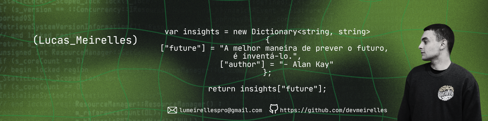

###

<h1 align="left">Opa 👋! Meirelles Aqui!</h1>

###

 

  

###

<h2 align="left">• About Me:</h2>

###

<h3 align="left">💻 Desenvolvedor Desktop-FrontEnd na Harmonit Sistemas 📆 20 anos 🎓 Cursando Bacharelado em Ciências da Computação (5/8) 🚀 Apaixonado por Tecnologia 🎸 Músico</h3>

###

<h2 align="left">• Tech Stack :</h2>

###

 

  
  
  
  
  
  
  
  
  
  
  
  
  
  
  
  
  
  
  
  
  
  
  

###

<h2 align="left">• Social Media:</h2>

###

  
  
  

###

<h2 align="left">• Some Stats:</h2>

###

  
  
  
  

###

 

<picture>
    <source media="(prefers-color-scheme: dark)" srcset="https://raw.githubusercontent.com/devmeirelles/devmeirelles/output/github-snake-dark.svg" />
    <source media="(prefers-color-scheme: light)" srcset="https://raw.githubusercontent.com/devmeirelles/devmeirelles/output/github-snake.svg" />
    
</picture>

###